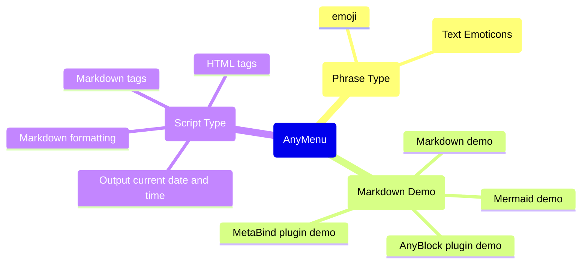

  

[中文](./README.md) | [English](./README.en.md)

# AnyMenu —— A powerful assistant for inputMethod / editor

## What is AnyMenu

- Positioning
    - A cross-platform, lightweight, fast, and customizable **Input Method Companion / Editor Companion** focused on text editing environments.
- Multi-platform
    - Obsidian Plugin
    - Cross-platform application
- Main function
    - Used to enhance input method or editor functionality, quickly generate templates, and provide auto-completion
- Specific functions
    - Quick text - Quick input of text, quick conversion of text
    - Quick panel invocation - Quick search box, quick multi-level menu, quick editor (under development)
    - Quick activation - Quick super key (Caps+), quick cursor (like vim), hot string (under development)
    - User-friendly dictionary/script - Customization, cloud market
    - Quick GPT (under development)

## Document (using / tutorial / example)

- [Document Homepage](https://any-menu.github.io/any-menu/README.md)
- [Shortcut - Advanced, Fast Cursor (Caps+ Scheme)](./docs/zh/quick_keys/README.md)
- [Dictionaries](./docs/zh/dict/)
  (Scripts are also considered a special type of dictionary.)
  - [1. Download AnyMenu Dictionaries Online](./docs/zh/dict/1.%20Online%20Dictionary%20Download.md)
  - [2. Manually Download AnyMenu Dictionaries](./docs/zh/dict/2.%20Manual%20Dictionary%20Download.md) (For use in offline environments / network issues / online marketplace unavailable / downloading unaudited third-party dictionaries)
  - [3. Writing AnyMenu Dictionaries](./docs/zh/dict/3.%20Writing%20Dictionaries.md)
  - [4. Uploading Custom AnyMenu Dictionaries](./docs/zh/dict/4.%20Uploading%20Dictionaries.md)
- Related articles
  - [Pain Point: Different Editor Environments Have Different Logics](./docs/en/article/DifferentEditor.md)
  - [What are the quick input / auto-completion solutions, and how do they compare?](./docs/zh/quick_input/对比.md)

## Features

Features will be introduced by different modules (categorized into multiple groups/abstract categories).

### Core Features

[table]

- Quick Input
  - Custom text, phrases, templates, etc., for quick input
- Quick Conversion
  - Convert selected text into corresponding text based on certain rules. Can be used for smart punctuation, smart tag pairs, text commands, formatting, translation, GPT, and more
- Quick Panel
  - Default shortcut: `Alt+A` (configurable). Summon the panel anytime, anywhere, similar to utools and quicker
- Quick Multi-level Menu
  - Visual output, especially when using the Obsidian version, allowing you to see the Markdown-rendered result of the output content
- Quick Search Box
  - In addition to using the multi-level menu, you can also quickly find and output desired content via the search box
- Shortcuts - Advanced (Caps+)
  - Use non-traditional system shortcuts like `Caps+` or `'+` to execute commands, avoiding crowded global shortcuts
- Quick Cursor
  - Utilizes advanced shortcuts, with a default configuration of a vim-like scheme based on the `Caps+` approach
- Multi-platform, High Compatibility, Unified
  - Not just an Obsidian plugin but also available as a standalone app
    In the app version, you can summon the same menu in any text-based editor environment, using the same operational logic to enhance your input method and current editor
- Others
  - Additional features that are under development, in progress, or planned can be found in [Miscellaneous](./docs/zh/杂项.md)

### Dictionary / Script Marketplace Module

Currently officially supported dictionaries: (Just a few examples are listed.)

Official dictionaries/scripts are continuously being expanded. You can also fully write your own custom dictionaries/scripts.

## Graphic and textual demonstrations of some functions

After configuring the dictionary, you can use it as follows:

Quick Input Template:

The app version can be used in any text environment:

You can download and manage online dictionaries/scripts, or you can manually create, manage and customize them.

## Differences Between Plugin Version and App Version

> [!warning]
> Regarding Simultaneous Installation:
> 
> - **Setup Method 1 (Default)**: The App version will automatically add Obsidian to its blocklist.
> - **Setup Method 2**: You can modify the `app_black_list` setting in the App version to remove Obsidian from the blocklist.
>
> Resulting Behavior:
> 
> - In the default setup, if both the Plugin and App versions are installed, the same hotkey will prioritize the Plugin version. (Corresponds to Setup Method 1)
> - You might prefer installing only the App version without the Plugin version. (Corresponds to Setup Method 2)
> - Alternatively, you can assign different hotkeys to each, allowing flexible use within Obsidian based on the situation. (Corresponds to Setup Method 2)

| Feature                          | Plugin version | App version |
| -------------------------------- | -------------- | ----------- |
| Multilevel menu                  | ✅             | ✅         |
| Search Box                       | ✅             | ✅         |
| Advanced Hotkeys (Caps+)         | ❌             | ✅         |
| Better Selected Text Capture     | ✅             | ✅         |
| Better Full Editor Text Capture  | ✅             | ❌         |
| Performance                      |                | Potentially better |

Among them

- "Better Selected Text Capture" is related to whether the text processing and replacement functions can be used.
- "Better Full Editor Text Capture" is related to whether functions such as finding the next matching text, multiple cursors, and full-text AI can be utilized. Even the ability to call some of the software's own APIs is possible.

## Highlights

Given that tools like Quicker and uTools already exist, what are the advantages compared to similar products? See below and [What Quick Input/Auto-completion Solutions Exist?](./docs/zh/Comparison.md)

- Zero Barrier to Entry
  - It's not the one with the shortest or fastest input chain (the fastest are input method phrases and hotstring solutions, but they have a steeper learning curve).
    However, it is definitely the most intuitive and easiest to use in terms of thinking logic.
  - Can be used with any input method solution or any input method software.
  - Easy to use, fast, powerful, and highly customizable.
- Cross-platform
  - If time permits, support for Windows/Linux platforms, Obsidian, and VSCode plugins will be added.
