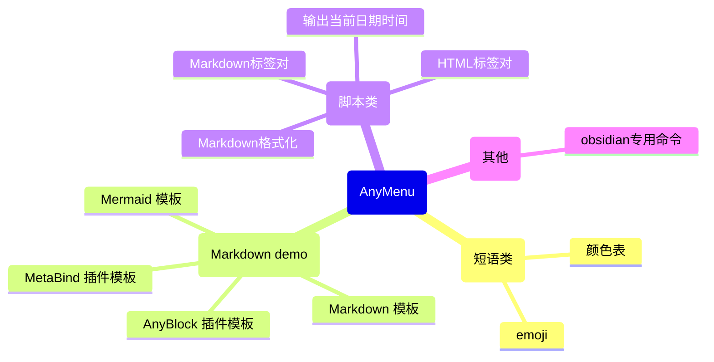
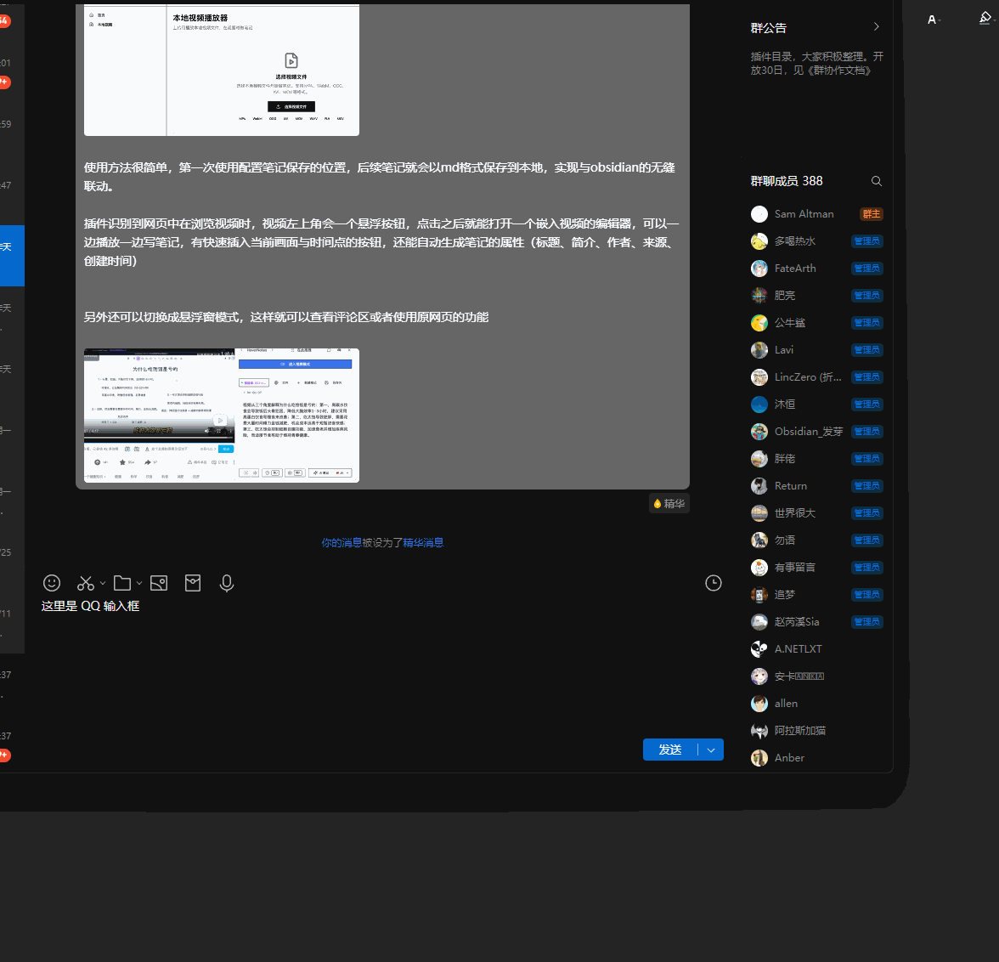
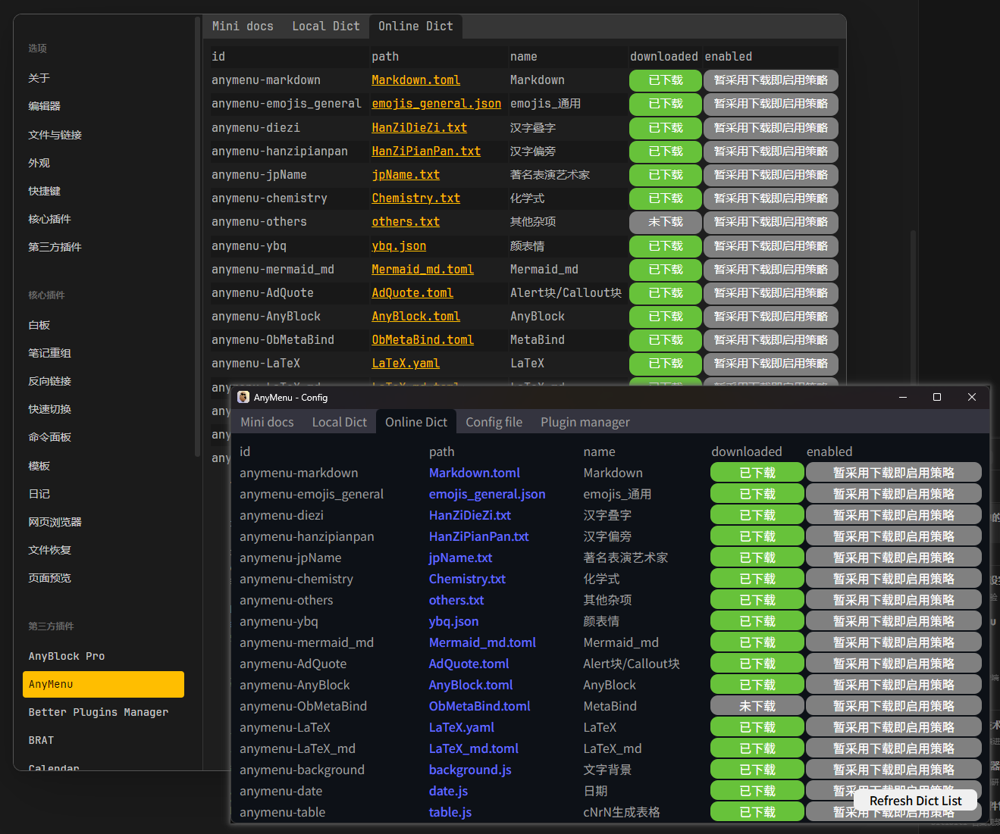

  

<h1 align="center">AnyMenu</h1>

  <strong>一款强大的输入法助手/编辑器助手</strong> 
  专注于文本编辑环境的、跨平台、轻量、快速、可自定义的输入法伴侣/编辑器编辑伴侣

  
  
  
  
   
  
  
   
  <a href="./README.zh.md">中文</a> | <a href="./README.md">English</a>

> [!WARNING]
> 还在开发完善中，目前为尝鲜版

## 什么是AnyMenu

- 定位
    - 专注于文本编辑环境的、跨平台、轻量、快速、可自定义的 **输入法伴侣/编辑器编辑伴侣**
- 多平台
    - Obsidian 插件
    - 跨平台应用软件
- 主要功能
    - 用于增强输入法或编辑器编辑功能，集成了多种可以在通用文本环境下使用的快捷输入工具。能快捷生成模板、自动补全
- 具体功能
    - 快捷文本 —— 快捷输入文本、快捷转换文本
    - 快捷面板召唤 —— 快捷搜索框、快捷多级菜单、快捷编辑器(开发中)
    - 快捷启用 —— 快捷超级键(Caps+)、快捷游标(类vim)、热字符串 (开发中)
    - 易用词典/脚本 —— 自定义、云市场
    - 快捷gpt (开发中)

## 文档 (使用 / 教程 / 示例)

- [文档主页](https://any-menu.github.io/any-menu/README.zh.md)
- [快键键-高级、快捷光标 (Caps+方案)](./docs/zh/quick_keys/README.md)
- [词典](./docs/zh/dict/)
  (脚本会被认作也是一种特殊的词典)
  - [1. 在线下载 AnyMenu 词典](./docs/zh/dict/1.%20在线下载词典.md)
  - [2. 手动下载 AnyMenu 词典](./docs/zh/dict/2.%20手动下载词典.md) (如在离线环境下使用 / 出现网络问题 / 在线市场无法使用 / 下载未经审核的第三方词典)
  - [3. 编写 AnyMenu 词典](./docs/zh/dict/3.%20编写词典.md)
  - [4. 上传自定义的 AnyMenu 词典](./docs/zh/dict/4.%20上传词典.md)
- 相关文章
  - [痛点之不同编辑器环境逻辑不同](./docs/zh/article/痛点-不同平台逻辑不同.md)
  - [有哪些快捷输入/自动补全方案，比较](./docs/zh/quick_input/对比.md)

## 功能

### 核心功能

[table]

- 快捷输入
  - 快捷输入自定义文本、短语、模板等
- 快捷转换
  - 将选中文本通过一定规则转换为对应文本的功能，可用于智能标点、智能标签对、文本指令、格式化、翻译、GPT等
- 快捷面板
  - 默认 `Alt+A` (可设置)，像 utools 和 quicker 那样随时随地召唤面板
- 快捷多级菜单
  - 可视化输出，特别是使用 Obsidian 版本时，可以看到输出内容对应的 Markdown 渲染结果
- 快捷搜索框
  - 除了使用多级菜单，你也可以通过搜索框快速查找你想输出的内容并输出
- 快捷键 - 高级 (Caps+)
  - 使用 `Caps+` `'+` 等非传统的系统快捷键，去使用命令，避免全局快捷键拥挤
- 快捷游标
  - 使用高级快捷键，默认配置了一套基于类 `Caps+` 方式的类 vim 方案
- 多平台，高通用，统一
  - 不仅仅是 Obsidian 插件，也有 App 版本
    App 版本中，你可以在任何文本类编辑器环境中召唤相同的菜单，使用相同的操作逻辑，来增强你的输入法和当前的编辑器
- 其他
  - 还有一些未成熟的、或开发中的、计划中的，见 [杂项](./docs/zh/杂项.md)

### 词典/脚本市场模块

目前官方支持的词典: (仅列举部分)

官方词典/脚本正在不断扩充中，你也完全可以编写你自己的自定义词典/脚本

## 部分功能的图文演示

当你配置好词典后，就可以像下面这样用了

快捷输入模板:

App版可以在任何文本环境下使用: (旧版截图)

可以快速搜索和输入表情包:

可以下载和管理在线词典/脚本，也可以手动编写、管理和自定义他们

## 插件版与App版的区别

> [!warning]
> 同时安装问题
> 
> - 设置方式一 (默认): App version 默认会将 Obsidian 添加到黑名单中。
> - 设置方式二: 你也可以在 App 版本中修改配置 `app_black_list` 以将 Obsidian 从黑名单中移出
>
> 效果
> 
> - 默认行为中，你可以当你同时安装了插件和软件版，则同一快捷键会优先用插件版 (对应设置方式一)
> - 你可能想只安装 App 版本而不想安装 Plugin 版本 (对应设置方式二)
> - 或者想同时修改他们使用不同的快捷键以在 Obsidian 中根据情况自由选择使用他们 (对应设置方式二)

|               | Plugin version | App version |
| ------------- | -------------- | ----------- |
| 多级菜单       | ✅              | ✅           |
| 搜索框           | ✅              | ✅           |
| 高级快捷键 (Caps+) | ❌              | ✅           |
| 更好地获取选中文本     | ✅              | ✅           |
| 更好地获取整个编辑器文本  | ✅              | ❌           |
| 性能            |                | 也许更优        |

其中

- "更好地获取选中文本" 关系着能不能使用文本处理并替换功能
- "更好地获取整个编辑器文本" 关系着能不能去找到下个匹配文本、多光标、全文AI等功能。甚至能去调用软件自身的一些 api

## 亮点

都已经有像 quicker 和 utools 这样的工具了，与同类产品相比，优势是什么？见下，与 [有哪些快捷输入/自动补全方案？](./docs/zh/quick_input/对比.md)

- 零门槛
  - 不是输入链最短最快的 (最快的是输入法短语，以及热字符串的方案，但有门槛)
    但绝对是使用最符合思维逻辑、最易用的
  - 可以搭配任何输入法方案、任何输入法软件
  - 易用的、快速的、强大的、高自定义的
- 跨平台
  - 如果有空，将会支持 Windows/Linux 平台、Obsidian、VSCode 插件

## TODO

插件可以做什么？

- 类似于 obsidian，自定义插件有两种行为
  - 一是自定义子面板
  - 二是围绕自带的核心子面板做扩展，如 搜索/工具栏/多级菜单/miniEditor
  - 特殊: 词典是什么。
    也属于脚本的一种，只是他们使用的是预设的是预设的脚本逻辑。
    这样就不需要为每个词典都写一个脚本去分别定义塞入数据库等行为。

NEW

- [x] 置顶按钮 - 面板固定功能
- [x] 置顶按钮 - 拖拽
- [x] GUI设置页移动到Core版本，并添加：拼音设置选项
- Ob
  - [ ] Obsidian 版本支持通信模式
  - [x] Ob 版修复无法搜索的问题 (似乎和拼音有关)
  - [x] Ob 版修复 Emoji 插件失效问题 (没复现了)
  - [ ] 专用选项: 当选中并转化输出时，自动将输出内容再次选中，以便连续转换
  - [ ] Obsidian 的高级快捷键 (目前设计的是 Ctrl/Alt 的快速单点)
- [x] 完成 Color/Bg 插件
  - [x] 需要先完成单按钮的多行为
  - [ ] 再完善页面
- [ ] 插件自定义的面板支持分离独立和固定 (Obsidian 和 App 版本的实现不同)
  - [ ] 自定义面板展出再后允许再隐藏回去
- [ ] 支持在搜索栏填入带参数的命令，或正则
  - 类似于 uTools 的正则、快捷计算器。或者那个 CxRx 的命令也可以去匹配一下
  - 后续再支持使用多行模式 (shift+enter) 表示快捷 ai 问题
- [ ] 三个面板支持更多属性。当前只支持 "展示的子面板列表"，还要支持是否聚焦、位置模式 (居中或其他)
- [x] 支持表情包词典
- [x] 置顶状态也要支持输出。这需要在不隐藏面板的前提下进行主动失焦

OLD

- [ ] 划选自动弹出模式
  - [x] obsidian 版本
  - [ ] (不一定能做到，很难) Tauri 版本
  - [ ] (进行中) 浏览器版本
  - [ ] 自动弹出模式时是非聚焦窗口，此时应该再去接管全局 Esc 按键，使非聚焦的前提下也能接管 Esc 事件并阻止替换
- [x] 完善误操作体验: 拖动时会在面板内按下，然后可能会拖动到面板外部再松开鼠标。此时会被误以为面板外聚焦，从而隐藏面板。
  - [x] 真的导致误操作后，需要能够正确恢复。实现: 目前插件面板是否能恢复看插件自己的实现
- [x] Obsidian 环境时，暴露 obsidian app 对象给插件
  - [ ] 添加元属性: 平台限制 (仅允许使用的平台，空表示全部允许，全部不允许没有意义)
- [x] 添加API: 插件自身的持久化存储
- [ ] Toolbar 增强
  - [ ] 支持 toolbar 的部分顺序模式，这样无需手动填写所有插件的顺序，仅需关注部分常用的顺序即可
  - [-] Toolbar 支持子菜单
  - [ ] 自定义 Toolbar 支持换行标识
- [x] 鼠标快捷键 右+左键时，改左键按下而非松开触发。人体感官上要快太多了
- [ ] AI 插件 (做了一部分了)
- [ ] 重构插件系统的管理器，待添加:
  - [x] 是否开启状态
  - [-] 是否进入搜索数据库
  - [-] 是否进入多级菜单
  - [x] 是否进入工具栏
- [x] 支持往 Panel 中添加自定义的子面板
- [x] 重构插件系统的 ctx，待添加 api:
  - [x] 通用
    - [x] 网络请求
  - (仅给自带插件用的，第三方插件一般用不着)
    - 唤出子面板
- [x] 方向键 & alt 键强化
  - [x] 支持方向键和 `alt+` 控制多级菜单
  - [x] 搜索结果支持 `alt+` 调用
  - [x] alt + a 的altkey选中快捷键与全局快捷键冲突，会互相导致对方无法正常工作
    一般来说全局快捷键优先级更高。
    目前计划让 alt 和 下一个键可以分离以此单击的方式，来使之不冲突
- [x] 支持纯鼠标快捷键
- [-] 完善 quicker note
  - [-] 支持代码着色
  - [x] 支持文本更宽更多行的情况
  - [x] 加入翻译 api
- [x] 允许切换 github/gitee 源
- [x] 需要修复 obsidian dict_path 修改后不生效的问题
- [x] 允许切换 cm/code miniEditor 引擎
  - 跑一个临时多光标/正则替换的场景
- [x] 子面板: 实现工具栏子面板 (当前逻辑: 主面板中可以包含任意组合的子面板: 搜索框、多级菜单、编辑框、工具栏(待实现))
- 子面板: 轮盘
- [x] feat: vPanel - 不抢焦点的窗口
  - 又分不抢焦点的临时窗口
  - 以及不抢焦点的置顶窗口 (例如用于模拟类 obsidian editing-toolbar 的操作)
  - [ ] 不抢焦点且非恒置顶模式下，鼠标外部聚焦需要隐藏窗口
- 可视化 (非文本ui) 的用户编辑词库 (含脚本) 面板 (要极其方便，允许自动id和零作者)
  - demo: 使用 miniEditor 快速添加自定义词库 (要极其方便，允许自动key值 (当前日期) 与叉号清空key值)
- [x] Core 模块的 i18n
- [x] 实现一个带 gui 的官方插件
  - 网格布局的颜色组
  - [x] emoji组
- 序号型多光标
- 选中模式 (如常规模式，翻译模式 (划选后直接弹出窗口并翻译))
- [ ] Obsidian 版本支持将所有脚本都注册为 Obsidian 命令
- 一个插件注册多个工具栏项。会有这个需求吗？

## TODO2

作为 AI 智能体的环境检测和输入用途:

从 openclaw 获得灵感，我打算将 AnyMenu 开发一种新用途：作为一种 AI 的上下文环境检测和输入器

例如:

- 鼠标在浏览器召唤面板的AI，然后告诉他：转发到QQ、收藏、记录到 Obsidian，他就会通过 OpenClaw/MCP/Skill 等方式完成该功能
  甚至在这里可以更准确地描述：保存到 Obsidian 中的什么位置
- 鼠标选中文件夹，然后告诉他：整理该文件夹内文件

这里面 AnyMenu 的一个作用是对于环境的检测

另外从渐进式披露获得灵感，这里采用渐进式披露。

例如在浏览器环境中打开AI面板后
- 如果你告诉 AI 只需要分享到好友、收藏到浏览器、使用快速剪藏 api 等。
  AI 无需读取浏览器内容的情况下，浏览器内容并不会输入给 AI。
- 如果你让 AI 去总结、翻译，内容才会给 AI。

减少 token 的损耗
