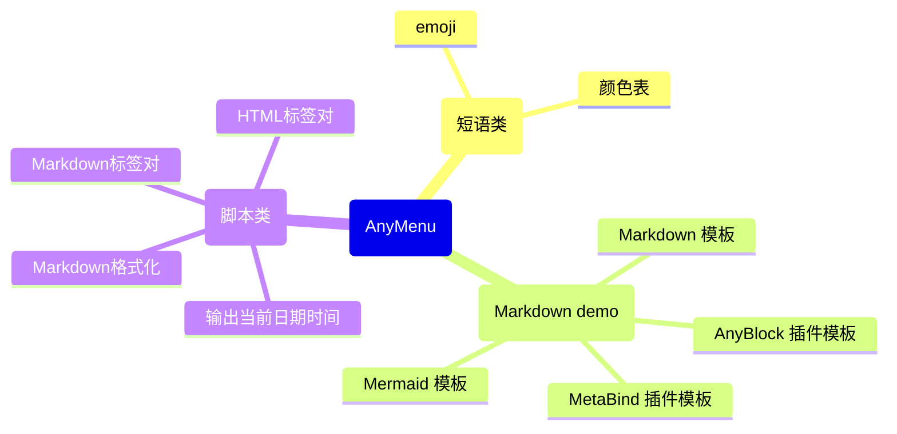

---
# icon use https://fontawesome.com/icons
# layout: OldLayout
home: true
title: AnyMenu
icon: home
heroText: AnyMenu
# tagline带图片时，文本最好长点能换行，否则空间分配不美观
tagline: |
  一款强大的输入法助手/编辑器助手，
  集成了多种可以在通用文本环境下使用的快捷输入工具
heroStyle:
  min-height: 450px
heroImage: https://raw.githubusercontent.com/any-menu/any-menu/refs/heads/main/docs/assets/icon-alpha.png
heroImageDark: https://raw.githubusercontent.com/any-menu/any-menu/refs/heads/main/docs/assets/icon-alpha.png

actions:
  - text: Introduce
    icon: book
    link: "#什么是anymenu"
  # - text: Demo
  #   icon: list
  #   link: ./README.show.md

features:
  - title: 快捷输入
    icon: italic
    details: 快捷输入文本、短语、符号、图标、模板等，可通过快捷搜索、快捷菜单、高级快捷键等方式进行
    link: ./zh/quick_input/

  - title: 快捷转换
    icon: repeat # or shuffle
    details: 除了直接输出，还可以选中文本后根据内容转换。可以用于智能标点、智能标签对、文本指令、格式化、翻译、GPT等

  - title: 快捷搜索
    icon: magnifying-glass
    details: 快捷搜索框。快速搜索定位到自定义模板、自定义短语
    link: ./zh/quick_search/

  - title: 快捷菜单
    icon: bars
    details: 快捷多级菜单能可视化地查看和调用输入模板和命令等，部分环境中也能可视化地预查看文本模板的渲染结果

  - title: 快捷超级组合键
    icon: keyboard
    details: 可以使用如 Caps+L 这种非常规系统快捷键代替传统快捷键。增添灵活性和功能性，避免全局快捷键区拥挤
    link: ./zh/quick_keys/

  - title: 快捷游标
    icon: i-cursor
    details: 能使用如 Caps+L 这种非常规快捷键来快捷操作输入游标和命令，自带了一套类 vim 系统
    link: ./zh/quick_keys/

  # - title: 快捷热串 (开发中)
  #   icon: font or quote-left or strikethrough
  #   details: AnyCaps 能使用非常规快捷键来快捷操作输入游标和命令

  - title: 多平台, 高通用，统一
    icon: bolt
    details: 支持 Obsidian 插件 / 电脑独立应用软件。你可以在任意文本编辑环境中使用相同的一套编辑逻辑，包括纯文本/富文本编辑器、网页、聊天输入框等

  - title: 性能强悍，体积小巧
    icon: bolt-lightning
    details: App 版使用 Rust 进行开发，WebView 进行显示，更你带来性能、美观、轻量的用户体验

  - title: 简单易用
    icon: box-open
    details: 开箱易用、无需配置，语法简单，可快速入门

  - title: 文档丰富, 好用
    icon: book
    details: 提供了美观的在线文档，为每一种插件子功能都进行了图文说明

  # - title: 可在线体验
  #   icon: flask-vial
  #   details: 提供了在线App版本，允许在线体验、测试
  #   link: https://any-block.github.io/any-block/

  - title: 扩展简单，在线词典/脚本
    icon: cloud
    details: 自带词典/脚本市场，会收录社区中用户自定义的词典/脚本，很多扩展你都无需编写和开发即可寻找和使用，功能丰富多样
    link: ./zh/dict/

  - title: 扩展灵活，自定义词典/脚本
    icon: plug
    details: 除了走线下载使用别人的词典和脚本外，你也可以自定义词典和自定义脚本
    link: ./zh/dict/
---

[中文](./README.md) | [English](./README.en.md)

# AnyMenu —— 一款强大的输入法助手/编辑器助手

## 什么是AnyMenu

- 定位
    - 专注于文本编辑环境的、跨平台、轻量、快速、可自定义的 **输入法伴侣/编辑器编辑伴侣**
- 多平台
    - Obsidian 插件
    - 跨平台应用软件
- 主要功能
    - 用于增强输入法或编辑器编辑功能，快捷生成模板、自动补全
- 具体功能
    - 快捷面板 (多级菜单, 搜索框, 迷你编辑器)、热字符串 (开发中)
    - 快捷输入文本、修改选中文本
    - 自定义词典/脚本、云词典/脚本
    - 快捷gpt

## 文档 (使用 / 教程 / 示例)

- [文档主页](https://any-menu.github.io/any-menu/README.zh.md)
- [快键键-高级、快捷光标 (Caps+方案)](./zh/quick_keys/README.md)
  - [AnyCaps 设计方案](./zh/quick_keys/Tutorial.md)
- [词典](./zh/dict/)
  (脚本会被认作也是一种特殊的词典)
  - [1. 在线下载 AnyMenu 词典](./zh/dict/1.%20在线下载词典.md)
  - [2. 手动下载 AnyMenu 词典](./zh/dict/2.%20手动下载词典.md) (如在离线环境下使用 / 出现网络问题 / 在线市场无法使用 / 下载未经审核的第三方词典)
  - [3. 编写 AnyMenu 词典](./zh/dict/3.%20编写词典.md)
  - [4. 上传自定义的 AnyMenu 词典](./zh/dict/4.%20上传词典.md)
- 相关文章
  - [痛点之不同编辑器环境逻辑不同](./zh/article/痛点-不同平台逻辑不同.md)
  - [有哪些快捷输入/自动补全方案，比较](./zh/quick_input/对比.md)

## 功能

### 核心功能

[table]

- 快捷输入
  - 快捷输入自定义文本、短语、模板等
- 快捷转换
  - 将选中文本通过一定规则转换为对应文本的功能，可用于智能标点、智能标签对、文本指令、格式化、翻译、GPT等
- 快捷面板
  - 默认 `Alt+A` (可设置)，像 utools 和 quicker 那样随时随地召唤面板
- 快捷多级菜单
  - 可视化输出，特别是使用 Obsidian 版本时，可以看到输出内容对应的 Markdown 渲染结果
- 快捷搜索框
  - 除了使用多级菜单，你也可以通过搜索框快速查找你想输出的内容并输出
- 快捷键 - 高级 (Caps+)
  - 使用 `Caps+` `'+` 等非传统的系统快捷键，去使用命令，避免全局快捷键拥挤
- 快捷游标
  - 使用高级快捷键，默认配置了一套基于类 `Caps+` 方式的类 vim 方案
- 多平台，高通用，统一
  - 不仅仅是 Obsidian 插件，也有 App 版本
    App 版本中，你可以在任何文本类编辑器环境中召唤相同的菜单，使用相同的操作逻辑，来增强你的输入法和当前的编辑器
- 其他
  - 还有一些未成熟的、或开发中的、计划中的，见 [杂项](./zh/杂项.md)

### 词典/脚本市场模块

目前官方支持的词典: (仅列举部分)

官方词典/脚本正在不断扩充中，你也完全可以编写你自己的自定义词典/脚本

## 部分功能的图文演示

当你配置好词典后，就可以像下面这样用了

快捷输入模板:

App版可以在任何文本环境下使用:

可以下载和管理在线词典/脚本，也可以手动编写、管理和自定义他们

## 插件版与App版的区别

> [!warning]
> 同时安装问题
> 
> - 设置方式一 (默认): App version 默认会将 Obsidian 添加到黑名单中。
> - 设置方式二: 你也可以在 App 版本中修改配置 `app_black_list` 以将 Obsidian 从黑名单中移出
>
> 效果
> 
> - 默认行为中，你可以当你同时安装了插件和软件版，则同一快捷键会优先用插件版 (对应设置方式一)
> - 你可能想只安装 App 版本而不想安装 Plugin 版本 (对应设置方式二)
> - 或者想同时修改他们使用不同的快捷键以在 Obsidian 中根据情况自由选择使用他们 (对应设置方式二)

|               | Plugin version | App version |
| ------------- | -------------- | ----------- |
| 多级菜单       | ✅              | ✅           |
| 搜索框           | ✅              | ✅           |
| 高级快捷键 (Caps+) | ❌              | ✅           |
| 更好地获取选中文本     | ✅              | ✅           |
| 更好地获取整个编辑器文本  | ✅              | ❌           |
| 性能            |                | 也许更优        |

其中

- "更好地获取选中文本" 关系着能不能使用文本处理并替换功能
- "更好地获取整个编辑器文本" 关系着能不能去找到下个匹配文本、多光标、全文AI等功能。甚至能去调用软件自身的一些 api

## 亮点

都已经有像 quicker 和 utools 这样的工具了，与同类产品相比，优势是什么？见下，与 [有哪些快捷输入/自动补全方案？](./zh/quick_input/对比.md)

- 零门槛
  - 不是输入链最短最快的 (最快的是输入法短语，以及热字符串的方案，但有门槛)
    但绝对是使用最符合思维逻辑、最易用的
  - 可以搭配任何输入法方案、任何输入法软件
  - 易用的、快速的、强大的、高自定义的
- 跨平台
  - 如果有空，将会支持 Windows/Linux 平台、Obsidian、VSCode 插件
