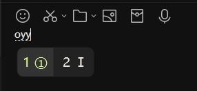
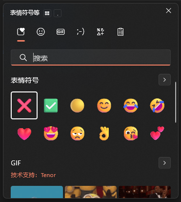
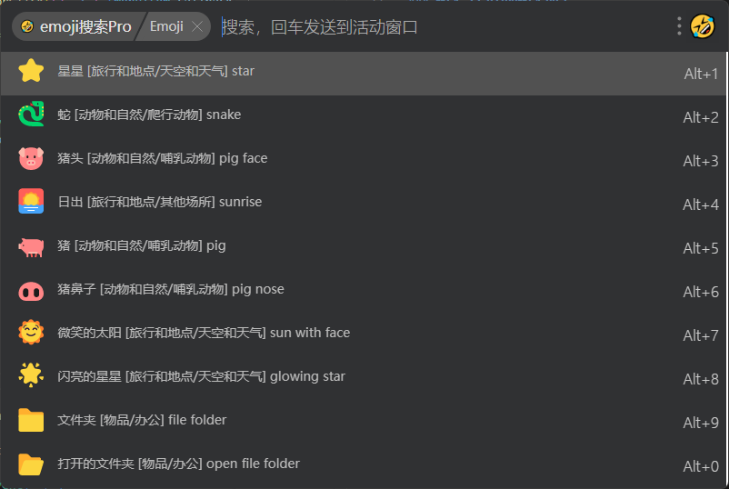

# Markdown快捷输入

## 输入法短语

以搜狗、RIME为例

优点：

- **速度超快**。掌控熟练后，速度是无与伦比的。输出特殊内容就像打字一样，效率比其他方案都要快得多
  适合于输入非常频繁的内容
- 通用性强，无论在任何文本编辑器环境，都能正常应用

缺点:

- 如果换输入法软件了，就要重新配置
  输入助手能解决这个问题，作为独立软件，可以配合任意输入法软件一同使用
- 如果换输入法了 (拼音、五笔、双拼等)，也要重新配置
  KV型能解决这个问题: 因为输入key值不关心你用什么输入法输入
- 其中搜狗支持的自定义词库数量被限制很多 (RIME则更大)
- 非零门槛。像命令前置型，要记住哪些命令起始是输入序号/颜表情/emoji/拆字等功能的
  KV型能解决这个问题：通常是非命令前置型的，语言自然的 (允许输入中文作为key)

## Obsidian插件输入助手

- emoji
- Latex Suite
- 插入模板
  - Editor Toolbar
  - Slash Commander/Slash snippets

缺点:

- 作为插件/专属应用，与其他软件体验不统一
- 不利于换笔记软件/换文本输入环境

## 输入助手

### 输入法自带的输入助手

像搜狗等输入法，会有些小工具。能帮助你输入emoji、特殊字符等

### Window自带的输入助手

- 缺点:
  - 支持的emoji过少
  - 非emoji (如颜表情) 不支持搜索

### UTools/Quicker输入助手

在快捷输入上，UTools Quicker 这两的作用和使用逻辑差不多

### **AnyMenu 输入助手**

### 更多软件

(QuickKV README 有介绍)
