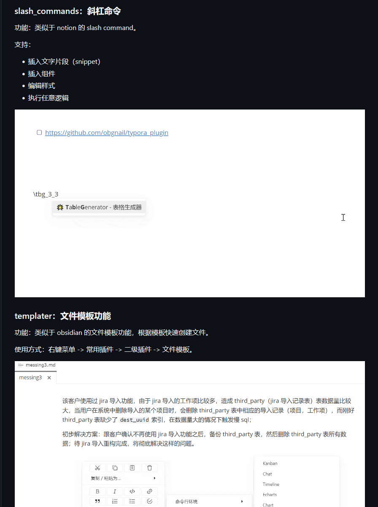

# 痛点之不同编辑器环境逻辑不同

痛点之不同编辑器环境逻辑不同，这里的逻辑包括:

- 快捷键不同!
- 菜单不同!
- 功能不同!

## 如何解决这一问题

其实你会发现其中的一些功能是可以完全不依赖于编辑器就能做到的！我完全可以把这部分功能抽离出来，变成一个独立的输入法助手/编辑器助手!

所以便有了 AnyMenu —— 可以配合任意文本类编辑器、输入法一同使用的强大的输入法助手/编辑器助手

## 举例说明

### 快捷键不同

- 代码编辑器:
  在 VSCode 中，"基于选中文本选中下一个匹配项" 的快捷键默认是 `Ctrl+D`，
  而在 CLion 中，快捷键默认是 `Alt+J`
- Markdown编辑器:
  在 Typora 中，切换源码/实时模式快捷键默认是 `Ctrl+/`
  而在 Obsidian 中，快捷键默认是 `Alt+E`

还有一些比较坑的，在 VSCode 中编辑 Markdown 时，纯文本黏贴的 Ctrl+Shift+V 会被用作打开预览功能

### 菜单与工具栏不同

- 包括右键菜单不同，工具栏不同等，这个很好理解
- 像 Obsidian/Typora/SiYuan 自带和插件提供的像插入菜单/工具栏

### 功能不同

- 像有的编辑器环境支持 tab 缩进，换行自动缩进，而有的不支持
- 有的编辑器支持多光标，而有的不支持
- 以前用的拼音输入法支持小键盘输入，或支持输入一些emoji或颜表情等。而我换输入法方案/换输入法软件后，这种功能就丢失了

而有的功能无法通过配置解决，有的功能则需要花费比较多的时间去调教

- 如快捷键。去慢慢修改各自的快捷键以让他们一致，而这其中很有可能会出现非常多快捷键冲突的情况
- 如输入模板。包括代码模板、Markdown模板、常用短语模板等。如果配置到编辑器中，其他编辑器也要去配置。如果配置到一些支持自定义短语的输入法的中，也非常受限 (有的不支持多行短语，有的有数量限制，而且你必须得记得对应的key值)

### 具体举例 - 模板插入功能

Typora 使用的是: obgnail/typora_plugin 插件的模板功能和斜杠功能

Obsidian 使用的是: Template/QuickerAdd 和 QuickShare/Latex Suite 这类插件

VSCode 使用的是: 内置的用户代码片段 (Snippets)

- Ctrl+Shift+P 输入 Configure User Snippets 来使用
  - 可以选择特定语言，在特定文件中使用
  - 可以选择 New Global Snippets file，在所有文件中使用

AnyMenu 不仅要统一他们的按键体验、UI体验、甚至配置体验 (通过同步统一的自定义词库文件，或通过云词库，哪怕更换电脑也无妨)
