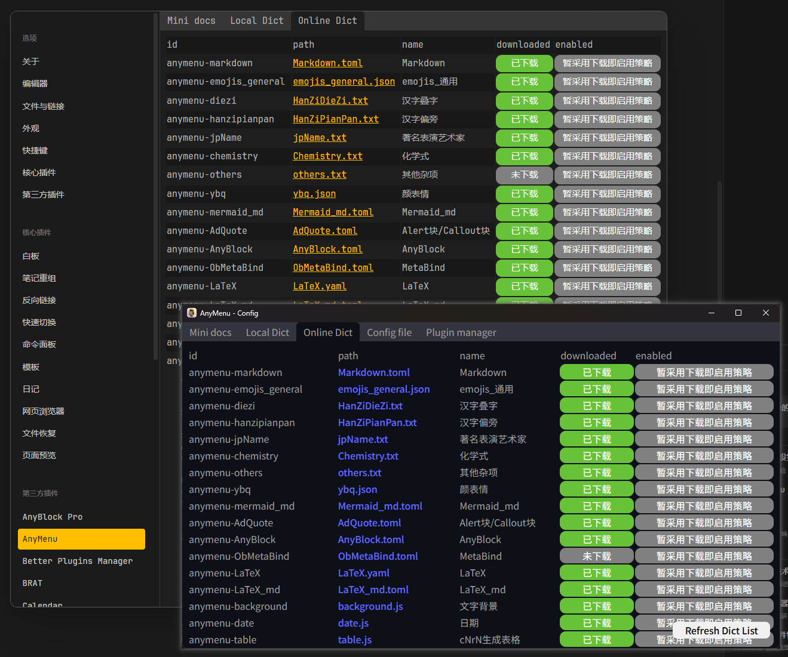

# 在线下载 AnyMenu 词典

## 云市场 (词典/脚本市场)

- 该项目同时维护 [github仓库](https://github.com/any-menu/any-menu) 和 [gitee仓库](https://gitee.com/any-menu/any-menu)，后者主要用于中国大陆访问词典数据
- 于 github/gitee 的本仓库中，你可以获取到官方维护的词典/脚本
- (后期可能推出管理用户自定义词典/脚本的功能，像 ComfyUI 的 pluginManager 工具那样，但该工具仅用于帮助你从 github 中寻找插件并快速安装，不进行审核)

## 如何使用

- obsidian 插件环境: 你可以先进入 obsidian AnyMenu 插件的设置面板，然后可以在该面板中找到 "在线词典" 标签页
- App 环境: 你可以在系统托盘 (通常在屏幕右下角) 中找到 AnyMenu 的图标，然后右键选择 "Config" 进入配置面板，然后可以在该面板中找到 "在线词典" 标签页

在 "在线词典" 面板中，你可以寻找到你想要的词典进行下载，并启用
