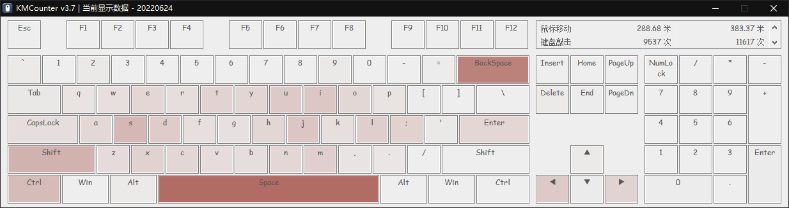
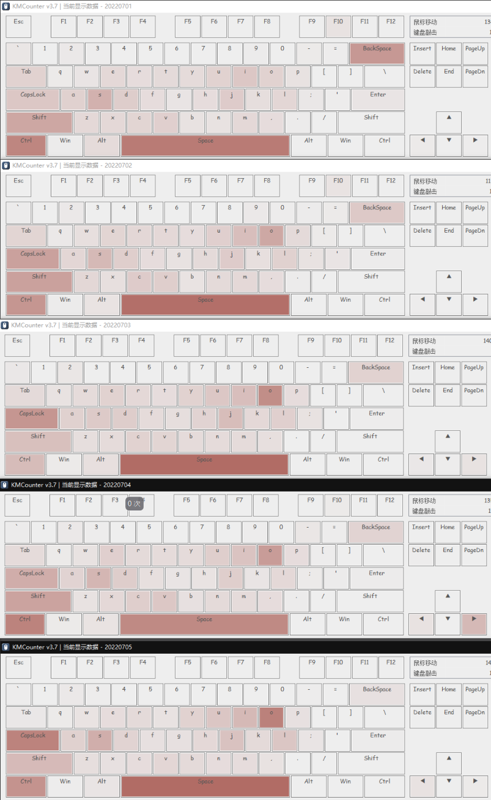

# AutoHotKey 作用案例：Windows上将Caps Lock用作修改键

> [!warning]
> 早期旧文档，已过期。仅供参考以前我个人的设计思路

思路参考：

- 参考：[如何在Windows上将Caps Lock用作修改键](http://www.howtoip.com/how-to-use-caps-lock-as-a-modifier-key-on-windows/)
- 补充：AutoHotKey虽然可自行变异，但支持平台为Win32/x64，不支持Mac。
- Mac使用其他方案，参考：https://www.163.com/dy/article/H9GSJ3370552EWQC.html

项目参考：

- https://github.com/Zesunlight/Experiment/tree/master/AutoHotKey
- github 的 capslock-plus


## 使用教程

### CapsLock To Modified 使用向导

设计了两套操作流，一个是抬起触发词选行选，一个是按下触发词选行选。
现在用的是第一套，如果要用第二套。就去文件里改（而且DFG以外的其他键也要改一下），两种方案的优劣也都写在文件里了

#### 编辑器 需求表1（增删查）

（增删查 在这里叫 增删移）


新操作流（V1.8）

|         | U        | K        | J        | L        | H 行/选        | ; 行/选        | I            | O            | 无/选        | 行            |
| ------- | -------- | -------- | -------- | -------- | -------------- | -------------- | ------------ | ------------ | ------------ | ------------- |
| 无      | 字上     | 字下     | 字左     | 字右     | ==**最**==左   | ==**最**==右   | 前删         | 后删         |              | 换行          |
| F 选/行 | **选**上 | **选**下 | **选**左 | **选**右 | **选==行==**左 | **选==行==**右 | ==**行**==删 | ==**行**==删 | **==行==选** | 删行 ~~增行~~ |
| G 词    | ~~词上~~ | ~~词下~~ | **词**左 | **词**右 | **选词**左     | **选词**右     | **词**删     | **词**删     | **词选**     | 拷贝行        |

补充

> 新空行，~~可以是 <kbd>CL</kbd> + <kbd>F</kbd> + <kbd>Space</kbd>，也~~ 可以是  <kbd>CL</kbd> + <kbd>;</kbd> + <kbd>Space</kbd>，都是三键快捷键


新操作流（V1.7.1）

|           | 字 段                                                     | 顶                                                           | 词 页（G可换D，但有冲突）                                    |
| --------- | --------------------------------------------------------- | ------------------------------------------------------------ | ------------------------------------------------------------ |
| 行移 (2)  | <kbd>CL</kbd> + <kbd>J</kbd> <kbd>L</kbd>                 | <kbd>CL</kbd> + <kbd>F</kbd> + <kbd>J</kbd> <kbd>K</kbd>     | <kbd>CL</kbd> + <kbd>G</kbd> + <kbd>J</kbd> <kbd>L</kbd>     |
| 段移 (2)  | <kbd>CL</kbd> + <kbd>U</kbd> <kbd>K</kbd>                 | <kbd>CL</kbd> + <kbd>F</kbd> + <kbd>U</kbd> <kbd>K</kbd>     | ~~<kbd>CL</kbd> + <kbd>G</kbd> + <kbd>U</kbd> <kbd>K</kbd>~~ 或 <kbd>CL</kbd> + <kbd>[</kbd> <kbd>]</kbd> |
| 删除 (2)  | <kbd>CL</kbd> + <kbd>I</kbd> <kbd>O</kbd>                 | <kbd>CL</kbd> + <kbd>F</kbd> + <kbd>I</kbd> <kbd>O</kbd> 或 <kbd>CL Sh</kbd> + <kbd>I</kbd> <kbd>O</kbd> | <kbd>CL</kbd> + <kbd>G</kbd> + <kbd>I</kbd> <kbd>O</kbd>     |
| 新增 (行) | <kbd>CL</kbd> + <kbd>Space</kbd>                          | <kbd>CL</kbd> + <kbd>F</kbd> + <kbd>Space</kbd>              | <kbd>CL</kbd> + <kbd>G</kbd> + <kbd>Space</kbd>              |
|           | --------------------------------------------------------- | ---------------------------------------------------------    | ---------------------------------------------------------    |


#### 编辑器 需求表2

与基础编辑功能，这个需求表的特点是需要额外的存储（剪切板、本地图片、撤销缓存），当然这个区别是无关紧要的
主要区别在于，需求表1是方向键区，用右手触发。需求表2是Ctrl区，有左手触发


舒适程度（尾指按CapsLock状态）（需要注意的是，D键~G键 已经被增删查占用了）

| 无名指2                        | 无名指1                        | 中指                           | 食指1                          | 食指2                          |
| ------------------------------ | ------------------------------ | ------------------------------ | ------------------------------ | ------------------------------ |
| Q                              | W                              | ==E==                          | R                              | T                              |
| ~~A~~                          | S                              | D (已占用, 不要用食指按)       | ==F== (已占用)                 | ==G== (已占用)                 |
| ~~Z~~                          | ~~X~~                          | C                              | **V**                          | B                              |
| ------------------------------ | ------------------------------ | ------------------------------ | ------------------------------ | ------------------------------ |


新操作流

| 无名指2                        | 无名指1                        | 中指                           | 食指1                          | 食指2                          |
| ------------------------------ | ------------------------------ | ------------------------------ | ------------------------------ | ------------------------------ |
| Shift                          | ==撤回==                       | 剪切                           | 复制                           | 黏贴                           |
| ~~全选~~                       | ==保存==                       | (已占用)                       | (已占用)                       | (已占用)                       |
| ~~Z~~                          | ~~X~~                          | C                              | **V**                          | B                              |
| ------------------------------ | ------------------------------ | ------------------------------ | ------------------------------ | ------------------------------ |


补充1

> 思考：
>
> 如果追求手感一致，对应WERT
> 如果追求对齐一致，对应QWER
> 不过 <kbd>Ctrl</kbd> + <kbd>Z X C V</kbd> 都是食指触发，如果追求手感一致，其实最多也就 <kbd>Ctrl</kbd> + <kbd>C</kbd> <kbd>V</kbd> 手感能一样，映射后其他键不可能还用食指按的
>
> 另外可以的话

补充2

> 需要修改的坏习惯
>
> <kbd>CapsLock</kbd> + <kbd>D</kbd> 里的D要用中指而非无名指按，S也是用无名指而非中指按
> <kbd>CapsLock</kbd> + <kbd>W</kbd> 和 <kbd>Ctrl</kbd> + <kbd>Z</kbd> 里的 W 和 Z 要用无名指而非无名指按


## 更新日志

构想：Q变Shift键。基本上Shift键是必须的，因为 redo也是高频用键
ED有联动：全词后复制
WD有联动：Shift+Ctrl

复制位由E改R也是可以的，ERT是XCV


### V1.8（Main）

==核心==（选一种方式理解就行）

解释一（缺点是两种移位操作被特殊了出来）

- <kbd>F</kbd> + 四种移位操作，解释为**选**。其他操作，解释为**行**
- <kbd>G</kbd> + 四种移位操作，解释为**词**
- <kbd>H</kbd> <kbd>;</kbd> + 无修饰键，解释为**行**。有修饰键，解释为**选**

解释二

- <kbd>F</kbd> + 六种移位操作，解释为**选**。其他操作，解释为**行**
- <kbd>G</kbd> + 六种移位操作，解释为**词**
- <kbd>H</kbd> <kbd>;</kbd> + <kbd>G</kbd> 特殊规定为**选词**。没英文习惯的，建议舍弃这个操作

解释三

- <kbd>F</kbd> 解释为**行**，<kbd>G</kbd> + 解释为**词**
- <kbd>F</kbd> + 四种移位操作时例外


该版本相较于V1.7.1，优点是紧凑，缺点为了紧凑性牺牲了少许规律性


#### 改进设计思路

| 版本           | 核心                                                         | 缺点                                                         |
| -------------- | ------------------------------------------------------------ | ------------------------------------------------------------ |
| V1.7.1         | F - 行，G - 词                                               | 选词行不方便（V1.8 就是为了解决这个缺点）                    |
| ~~V1.8 Beta1~~ | 将 <kbd>JLUK</kbd> 分别换成 <kbd>H;YP</kbd> 后，移动会变成选择移动 | 1. 热力图集中，2. Home End 需要三键快捷键，3. 选移分离。非常难受 |
| V1.8 Beta2     | F和G，在移动和增删分别表示两种意思                           |                                                              |


#### 6种移位情况 + 4种其他情况

V1.7

|      | U            | K            | J        | L        | H        | ;        | I        | O        | 无       | 行     |
| ---- | ------------ | ------------ | -------- | -------- | -------- | -------- | -------- | -------- | -------- | ------ |
| 无   | 字上         | 字下         | 字左     | 字右     | **最**左 | **最**右 | 前删     | 后删     |          | 新行   |
| F    | ~~**行**上~~ | ~~**行**下~~ | **行**左 | **行**右 | ~~最左~~ | ~~最右~~ | **行**删 | **行**删 | **行**选 | 新空行 |
| G    | ~~**词**上~~ | ~~**词**下~~ | **词**左 | **词**右 | ~~最左~~ | ~~最右~~ | **词**删 | 词删     | **词**选 | 拷贝行 |

V1.8 Beta1

|      | U        | K        | J    | L    | H          | ;          | I    | O    | Y              | P              | 无   | 行     |
| ---- | -------- | -------- | ---- | ---- | ---------- | ---------- | ---- | ---- | -------------- | -------------- | ---- | ------ |
| 无   | 字上     | 字下     | 字左 | 字右 | **选**左   | **选**右   | 前删 | 后删 | **选**上       | **选**下       |      | 新行   |
| F    | ~~行上~~ | ~~行下~~ | 行左 | 行右 | **选**行左 | **选**行右 | 行删 | 行删 | ~~**选**行上~~ | ~~**选**行下~~ | 行选 | 新空行 |
| G    | ~~词上~~ | ~~词下~~ | 词左 | 词右 | **选**词左 | **选**词右 | 词删 | 词删 | ~~**选**词上~~ | ~~**选**词下~~ | 词选 | 拷贝行 |

V1.8 Beta2 

|         | U        | K        | J        | L        | H 行/选        | ; 行/选        | I            | O            | 无/选        | 行     |
| ------- | -------- | -------- | -------- | -------- | -------------- | -------------- | ------------ | ------------ | ------------ | ------ |
| 无      | 字上     | 字下     | 字左     | 字右     | ==**最**==左   | ==**最**==右   | 前删         | 后删         |              | 新行   |
| F 选/行 | **选**上 | **选**下 | **选**左 | **选**右 | **选==行==**左 | **选==行==**右 | ==**行**==删 | ==**行**==删 | **==行==选** | 新空行 |
| G 词    | ~~词上~~ | ~~词下~~ | **词**左 | **词**右 | **选词**左     | **选词**右     | **词**删     | **词**删     | **词选**     | 拷贝行 |


### V1.7.1

将 词行选 重新改回了释放触发

D键改成词模式，F是行模式

但D键有三个键都存在三键冲突，就很难受


### V1.7（Main）

==将 Caps F 解释为 “选择所在词”，将 Caps G 解释为 “选择所在行”==，大大简化了结构

操作需求

|           | 字 段                                                     | 词 页                                                     | 顶                                                        |
| --------- | --------------------------------------------------------- | --------------------------------------------------------- | --------------------------------------------------------- |
| 行移 (2)  | 字移                                                      | 词移                                                      | 顶移                                                      |
| 段移 (2)  | 段移                                                      | *页移*                                                    | *顶移*                                                    |
| 删除 (2)  | 字删                                                      | 词删                                                      | 行删                                                      |
| 选中      | 字选                                                      | 词选（词前 / 行尾 / 整行）                                | 行选（行前 / 行尾 / 整行）                                |
| 新增 (行) | 当前位置增加空行                                          | 末尾位置增加空行                                          | 拷贝增加行                                                |
|           | --------------------------------------------------------- | --------------------------------------------------------- | --------------------------------------------------------- |


旧操作流：

|           | 字 段                                                     | 词 页                                                        | 顶                                                        |
| --------- | --------------------------------------------------------- | ------------------------------------------------------------ | --------------------------------------------------------- |
| 行移 (2)  | <kbd>←</kbd> <kbd>→</kbd>                                 | <kbd>Ctrl</kbd> + <kbd>←</kbd> <kbd>→</kbd>                  | <kbd>Home</kbd> <kbd>End</kbd>                            |
| 段移 (2)  | <kbd>↑</kbd> <kbd>↓</kbd>                                 | <kbd>PageUp</kbd> <kbd>PageDown</kbd>                        | <kbd>Ctrl</kbd> + <kbd>Home</kbd> <kbd>End</kbd>          |
| 删除 (2)  | <kbd>Backspace</kbd> <kbd>Delete</kbd>                    | <kbd>Ctrl</kbd> + <kbd>Backspace</kbd> <kbd>Delete</kbd> / <kbd>C S</kbd> + <kbd>D</kbd> (部分) | <kbd>Ctrl</kbd> + <kbd>D</kbd> (部分)                     |
| 选中      | <kbd>Shift</kbd> + <kbd>←</kbd> <kbd>→</kbd>              | <kbd>S C</kbd> + <kbd>←</kbd> <kbd>→</kbd> / <kbd>Ctrl</kbd> + <kbd>D</kbd> (部分) | <kbd>Shift</kbd> + <kbd>Home</kbd> <kbd>End</kbd>         |
| 新增 (行) | <kbd>Enter</kbd>                                          | <kbd>End</kbd>，<kbd>Enter</kbd>                             | <kbd>Ctrl</kbd> + <kbd>D</kbd> (部分)                     |
|           | --------------------------------------------------------- | ---------------------------------------------------------    | --------------------------------------------------------- |


新操作流

|           | 字 段                                                     | 词 页（G可换D，但有冲突）                                    | 顶                                                           |
| --------- | --------------------------------------------------------- | ------------------------------------------------------------ | ------------------------------------------------------------ |
| 行移 (2)  | <kbd>CL</kbd> + <kbd>J</kbd> <kbd>L</kbd>                 | <kbd>CL</kbd> + <kbd>G</kbd> + <kbd>J</kbd> <kbd>L</kbd>     | <kbd>CL</kbd> + <kbd>F</kbd> + <kbd>J</kbd> <kbd>K</kbd> 或 <kbd>CL</kbd> + <kbd>H</kbd> <kbd>;</kbd> |
| 段移 (2)  | <kbd>CL</kbd> + <kbd>U</kbd> <kbd>K</kbd>                 | ~~<kbd>CL</kbd> + <kbd>G</kbd> + <kbd>U</kbd> <kbd>K</kbd>~~ 或 <kbd>CL</kbd> + <kbd>[</kbd> <kbd>]</kbd> | <kbd>CL</kbd> + <kbd>F</kbd> + <kbd>U</kbd> <kbd>K</kbd>     |
| 删除 (2)  | <kbd>CL</kbd> + <kbd>I</kbd> <kbd>O</kbd>                 | <kbd>CL</kbd> + <kbd>G</kbd> + <kbd>I</kbd> <kbd>O</kbd>     | <kbd>CL</kbd> + <kbd>F</kbd> + <kbd>I</kbd> <kbd>O</kbd> 或 <kbd>CL Sh</kbd> + <kbd>I</kbd> <kbd>O</kbd> |
| 选中      | <kbd>CL Sh</kbd> + <kbd>J</kbd> <kbd>L</kbd>              | <kbd>CL</kbd> + <kbd>G</kbd>                                 | <kbd>CL</kbd> + <kbd>F</kbd>                                 |
| 新增 (行) | <kbd>CL</kbd> + <kbd>Space</kbd>                          | <kbd>CL</kbd> + <kbd>G</kbd> + <kbd>Space</kbd>              | <kbd>CL</kbd> + <kbd>F</kbd> + <kbd>Space</kbd>              |
|           | --------------------------------------------------------- | ---------------------------------------------------------    | ---------------------------------------------------------    |


补充1

> 旧操作流 里的 “部分” 指的是：
> <kbd>Ctrl</kbd> + <kbd>D</kbd>，在 Obsidian HBuilder 里是行删，在Typora VSCode 里是选中词
> 并且这里的行删会删除换行符

补充2

> 这里主要是讲编辑器
>
> 浏览器情况有所不同
> 浏览器的上下顶移是 <kbd>Home</kbd> <kbd>End</kbd>，不用加Ctrl，当然加了也没事
> 浏览器可能还有左移标签和右移标签
>
> 桌面环境也有所不同
> 比如切换桌面

补充3

> 词行平衡
>
> 频率估计：（频率估计是为了，让高频操作快捷键更容易触发）
>
> 横向对比 字词行：
>
> ​		字操作 > 词操作 或 行操作
> ​		在中文语境下，词的移删选 的使用频率是很低的，主要是字操作
> ​		英文语境下，词移删选 的使用频率会比较高。
> ​		那么应该如何平衡两者呢？
>
> 纵向对比 移删选：
>
> ​		字删 > 字移 > 字选
> ​		词选 词移 词删，好像都差不多
> ​		行移 > 行删 > 行增 > ~~行选~~
>
> 混杂对比：
>
> ​		字操作 > **行**删 > 行顶移 (有替代) > 新行 > 词选 > 词移
>
> 
>
> 而且 <kbd>D</kbd> 应该代表着什么？在旧体系中，<kbd>Ctrl</kbd> + <kbd>D</kbd> 即可以是选词删词、也可以是删行，那他应该代表词还是行？
>
> 于是我设计了两套规则
>
>   		1. **D词F行 (G词)**。一来因为 D C 有联动（选词复制常见，选行复制不多见），二来WOR**D**，所以我倾向与用D来表示词。
>   	   并且让D有附带的 “复制” 意义，F是新行，D是拷贝为新行
>   		2. F词G行 (D词)
>
> 先试用着吧

补充4

> 键盘三键冲突。按住两个键后按第三个键，第三个键有的会失效
>
> CL + D：
> `RUI[]  AFL；‘  。 Space`
> CL + F：
> `TY\  D  B,`


### V1.6 +

后面用 git 来管理了

|                                                     | <kbd>CapsLock</kbd> +<br />无修饰键                      | <kbd>Caps F</kbd> +<br />F表示 “词”                      | <kbd>Caps Shift</kbd> +<br />Shift表示 “选”              | <kbd>Caps F</kbd> +<br />~~G表示 “行”~~ |
| --------------------------------------------------- | -------------------------------------------------------- | -------------------------------------------------------- | -------------------------------------------------------- | --------------------------------------- |
| <kbd>U</kbd> <kbd>J</kbd> <kbd>K</kbd> <kbd>L</kbd> | <kbd>↑</kbd> <kbd>←</kbd> <kbd>↓</kbd> <kbd>→</kbd> (字) | <kbd>↑</kbd> <kbd>←</kbd> <kbd>↓</kbd> <kbd>→</kbd> (词) | <kbd>↑</kbd> <kbd>←</kbd> <kbd>↓</kbd> <kbd>→</kbd> (选) |                                         |
| <kbd>H</kbd> <kbd>；</kbd> 表示“行”或“选”           | <kbd>←</kbd> <kbd>→</kbd> (行)                           | <kbd>←</kbd> <kbd>→</kbd> (选词)                         | <kbd>←</kbd> <kbd>→</kbd> (选行)                         |                                         |
| <kbd>I</kbd> <kbd>O</kbd>                           | 前删  后删                                               | 前删  后删 (词)                                          | 前删  后删 (行)                                          |                                         |
| <kbd>N</kbd> <kbd>M</kbd>                           |                                                          |                                                          |                                                          |                                         |
| <kbd>[</kbd> <kbd>]</kbd>                           | <kbd>↑</kbd> <kbd>↓</kbd> (行)                           |                                                          |                                                          |                                         |
|                                                     | ----------------------------------                       | ----------------------------------                       | ----------------------------------                       | ----------------------------------      |

其中，为了记忆更形象，用了一些其他描述词。

> <kbd>←</kbd> <kbd>→</kbd> (行) 表示 <kbd>Home</kbd> <kbd>End</kbd>
> <kbd>↑</kbd> <kbd>↓</kbd> (行) 表示 <kbd>PageUp</kbd> <kbd>PageDown</kbd>
> 前删  后删 表示 <kbd>Backspace</kbd> <kbd>Delete</kbd>


###  V1.5  加了符号快键

BUG Fixing：AutoHotKey输出中文字符串乱码

参考：https://zhuanlan.zhihu.com/p/472008013

将文件另存为编码为 “带bom的UTF-8" 文件即可


### V1.4

UJKL 方案

使用频率

> 前删 >> (左 右 上 后删) > 下  > (至左 至右 下)
> 方向键我改过很多版，最终锁定了

修改：将删除键由o改u又改到i，增加了ctrl键的部分模拟

```assembly
; AutoHotKey 1.1 Capslock Remapping Script 

; CL 第二行
Capslock & h::Send {Blind}{Home DownTemp}
Capslock & h up::Send {Blind}{Home Up}
Capslock & j::Send {Blind}{Left DownTemp}
Capslock & j up::Send {Blind}{Left Up}
Capslock & k::Send {Blind}{Down DownTemp}
Capslock & k up::Send {Blind}{Down Up}
Capslock & l::Send {Blind}{Right DownTemp}
Capslock & l up::Send {Blind}{Right Up}
Capslock & `;::Send {Blind}{End DownTemp}
Capslock & `; up::Send {Blind}{End Up}

; CL 第一行
Capslock & y::SendInput {Blind}{PgUp Down}
Capslock & y up::SendInput {Blind}{PgUp Up}
Capslock & u::SendInput {Blind}{Up Down}
Capslock & u up::SendInput {Blind}{Up Up}
Capslock & i::SendInput {Blind}{Backspace Down}
Capslock & i up::SendInput {Blind}{Backspace Up}
Capslock & o::SendInput {Blind}{Delete Down}
Capslock & o up::SendInput {Blind}{Delete Up}
Capslock & p::SendInput {Blind}{PgDn Down}
Capslock & p up::SendInput {Blind}{PgDn Up}

; 第三行
Capslock & n::SendInput ^+{Left} {Backspace}
Capslock & m::SendInput {Blind}{Backspace Down}
Capslock & m up::SendInput {Blind}{Backspace Up}
;Capslock & <::SendInput {Blind}{Delete Down}
;Capslock & < up::SendInput {Blind}{Delete Up}
Capslock & >::SendInput {Blind}{Delete Down}
Capslock & > up::SendInput {Blind}{Delete Up}
Capslock & /::SendInput ^+{Right} {Delete}

; CL 第零行
Capslock & `::Send {ctrl down}`{ctrl up}
Capslock & 1::Send {ctrl down}1{ctrl up}
Capslock & 2::Send {ctrl down}2{ctrl up}
Capslock & 3::Send {ctrl down}3{ctrl up}
Capslock & 4::Send {ctrl down}4{ctrl up}
Capslock & 5::Send {ctrl down}5{ctrl up}
Capslock & 6::Send {ctrl down}6{ctrl up}

; 其他行
Capslock & Space::SendInput {Blind}{Enter Down}
Capslock & Space up::SendInput {Blind}{Enter Up}
+Space::SendInput {Blind}{Enter Down}
+Space up::SendInput {Blind}{Enter Up}

; CL Shift 切换大小写
Capslock & Esc::
If GetKeyState("CapsLock", "T") = 1
    SetCapsLockState, AlwaysOff
Else 
    SetCapsLockState, AlwaysOn
Return

; 单击CL为Esc键
CapsLock::Send, {ESC}
;CapsLock::Send, {VKC0} ; mapped to `
;CapsLock & c::Run calc
;CapsLock & n::Run notepad
return

; Win 热键
#c::Run calc ; 原动作是叫小娜
#n::Run notepad

; RShift 热键
RShift::SendInput {Blind}{Shift Up Control Down}
RShift up::SendInput {Blind}{Control Up}
return
```


### V1.3

JKIL 方案


思考：上下左右哪套方案模拟？

#### 三种键位设计

| 字母区按键选择  | 优缺点                                                       |
| --------------- | ------------------------------------------------------------ |
| IJKL - 上左下右 | 完全符合小键盘按键，习惯成本低<br />右方向键方便衔接分号和转行 |
| HJKL            | 只使用一排，方便其他键位的映射<br />右方向键方便衔接分号和转行 |
| JKL;            | 只使用一排，方便其他键位的映射<br />右方向键方便衔接分号和转行<br />使用时手指不需要移位 |
| SDFE/ASDW       | 左手键位，但由于我现在用的CapsLock作为映射键，故不采用       |

#### 横排映射设计

| 方案                          | 优缺点                                                       |
| ----------------------------- | ------------------------------------------------------------ |
| HJKL - 上右左下               | 很别扭的映射，是按使用频率和按键方便度来映射的。太别扭不采纳 |
| HJKL/JKL; - 上左下右/左下右上 | 有三个键符合小键盘按键，习惯成本低。但我在网上没见过别人这么设计 |
| HJKL/JKL; - 左下上右          | 右方向键更方便衔接分号和转行。用的人多，网上搜的都是这两种方案<br />原因：**h, I, j, k是VIM的传统导航方向键** |
| HJKL/JKL; - 左上下右          | 感觉对称性更强，左上下右是书写习惯 是主对角线                |
| 上下左右/下上左右             | 左右连接在一起，方便敲代码但不方便敲表格                     |

#### 频率查看

（为了使方案更合理，下载了按键统计软件whatpulse来统计）

打代码状态

- 右方向 49次
- 左方向 37次
- 下方向 12次
- 上方向 8次
- end 23次

日常状态

- 134
- 163
- 15
- 13
- 23
- L 138次
- ；53次

高频键

- BackSpace 470
- Enter 384
- Delete 26
- (  47
- @  47？
- += 18

#### 后续键

End后面大多加 `;+Enter` 或 `{+Enter` 或 `Enter`

右方向键后大多加 `;+Enter` 或 `{+Enter` 或 `Enter` 或 `右方向键`

左方向键后大多加 `左方向键+Bakcspace+...+End`

上下方向键后大多加 `上下方向键`


也就说，`End/右方向键 ; Enter` 和 `End/右方向键 { Enter`

最好连按起来能比较顺畅

> | P;O;       | 连按手感差   |
> | ---------- | ------------ |
> | K;L;N;M;U; | 连按手感较好 |
> | J;;; ;     | 连按手感好   |
> | ;'         | 连按手感差   |


而且有个问题

在 `End ; Enter` 或 `右方向键 ; Enter` 的连按中，第13个按键需要CapsLock修饰键，但第2个按键却不需要，也会造成别扭感

- 一个方案是将三键连按改为两键连按
  - 用L映射右方向键，O映射为End，`;`则映射为`;+Enter`
  - 按键连按就变成了：O;或L;
  - 缺点：需要多加一个额外映射Enter的键
- 一个方案是不给；设置映射
  - Cap+;  还是原映射
  - Cap+{  则相当于Shift+[
  - 缺点：少映射浪费了一个键


旧

CapsLoack映射表1 —— 梯形结构

> |      |      | Begin | End  | 回退 |        |
> | ---- | ---- | ----- | ---- | ---- | ------ |
> |      | 左   | 下    | 上   | 右   | Delete |
> | %%   | %%   | 000   | 000  | 000  | Enter  |

#### 最终敲定方案

右半区（高频）

> |      |      | Y    | U    | I    | O    | P    | [          |
> | ---- | ---- | ---- | ---- | ---- | ---- | ---- | ---------- |
> | F    | G    | H    | J    | K    | L    | ;    | '          |
> | V    | B    | N    | M    | <    | >    | /    | Shift/空格 |

CapsLoack映射表2 —— 右和大右

> | Down     | Up       | ~~重做~~  | ~~撤销~~ | **上** | **Back**     | **Delete**       | **选重8**       |
> | -------- | -------- | --------- | -------- | ------ | ------------ | ---------------- | --------------- |
> | ~~撤销~~ | ~~重做~~ | **Begin** | **左**   | **下** | **右**       | **End**          | **选重7**       |
> | 选重3    | 选重4    | ~~删词~~  | ~~删字~~ | %%     | ~~Delete字~~ | ~~**Delete词**~~ | **选重6/Enter** |

补充：

Shift/CapsLock+空格 都要映射为 Enter。Shift是为了让`{`和`Enter`更好地衔接

——

左半区（低频）

左半区在尾指已经被CapsLock占用的情况下，也就FGBV就最好按的

#### 热力图改变



七月一到七月五使用情况：
缺点：本来想着o离BackSpace近点，但是o键使用过度会导致无名指很酸，毕竟不是常用手指。
现试图将其位置改为u键。缺点是手部运动会增加，脱离原位，不方便后续输入的衔接……
可以说这是效率和负荷之间的的选择了，其实使用 I 键是最好的了，但是会破坏方向键结构




### V1.2

代码

CL HJKL; 分别为 左下上右


### V1.1

https://www.cnblogs.com/tengzijian/p/14493559.html2

| Key                | Mapped Key                           |
| :----------------- | ------------------------------------ |
| CapsLock + J/K/I/L | ←/↓/↑/→                              |
| CapsLock + U/D     | PageUp/PageDownD                     |
| CapsLock + A/E     | Home/End                             |
| CapsLock + F       | Backspace                            |
| CapsLock + D       | Delete                               |
| CapsLock + V       | Shift + Insert 粘贴，兼容 Linux 终端 |
| CapsLock + C       | 计算器 Calc                          |
| CapsLock + N       | 记事本 Notepad                       |
| CapsLock           | Esc键                                |
| CapsLock + Space   | 切换大小写                           |


### ~~V1~~

（有bug，被自动翻译了一遍，操蛋）

```assembly
  #NoEnv; 为提高性能并与将来的AutoHotkey版本兼容而推荐。
 ;  #Warn; 启用警告以帮助检测常见错误。
 #SingleInstance FORCE; 跳过调用对话框，并以静默方式替换此脚本的先前执行实例。
 SendMode输入; 由于其卓越的速度和可靠性，因此推荐用于新脚本。
 SetWorkingDir％A_ScriptDir％; 确保起始目录一致。


 ; ================================================= ==============================================
 ;  CapsLock处理。 必须双击CapsLock才能打开或关闭CapsLock模式。
 ; ================================================= ==============================================
 ; 必须双击CapsLock才能打开或关闭CapsLock模式。
大写锁定：：
     KeyWait，CapsLock; 永远等待直到Capslock释放。
     KeyWait，CapsLock，D T0.2; 如果CapsLock在0.2秒内未降低，则ErrorLevel = 1。
    如果（（ErrorLevel = 0）&&（A_PriorKey =“ CapsLock”））; 是否双击CapsLock？
         {
         SetCapsLockState，％GetKeyState（“ CapsLock”，“ T”）吗？  “ Off”：“ On”； 切换CapsLock LED的状态
         }
返回


 ; ================================================= ==============================================
 ; 具有CapsLock修改器的热键。 参见 https://autohotkey.com/docs/Hotkeys.htm#combo
 ; ================================================= ==============================================
 ; 获取所选单词的定义。    
 CapsLock和d ：：
     ClipboardGet()
    运行http://www.google.com/search?q=define+%clipboard%; 用剪贴板内容启动
     ClipboardRestore()
返回

 ;  GOOGLE选定的文本。
 CapsLock和g ::
     ClipboardGet()
    运行http://www.google.com/search?q=%clipboard%; 用剪贴板内容启动
     ClipboardRestore()
返回

 ; 对所选单词进行词库
 CapsLock＆t ::
     ClipboardGet()
    运行http://www.thesaurus.com/browse/%Clipboard%; 用剪贴板内容启动
     ClipboardRestore()
返回

 ; 进行所选单词的WIKIPEDIA
 CapsLock和w ::
     ClipboardGet()
    运行，https://en.wikipedia.org/wiki/%clipboard%; 用剪贴板内容启动
     ClipboardRestore()
返回

 ; ++++++++++++++++++++++++++++++++++++++++++++++++++++ ++++++++

 ; ================================================= ==============================================
 ; 剪贴板助手功能。
 ; ================================================= ==============================================
 ClipboardGet()
 {
     OldClipboard：= ClipboardAll；保存现有剪贴板。
    剪贴板：=“”
    发送^ c；将所选测试复制到剪贴板
     ClipWait 0
    如果ErrorLevel
         {
         MsgBox，未选择文本！
        返回
         }
 }


 ClipboardRestore()
 {
    剪贴板：= OldClipboard
 }
```


