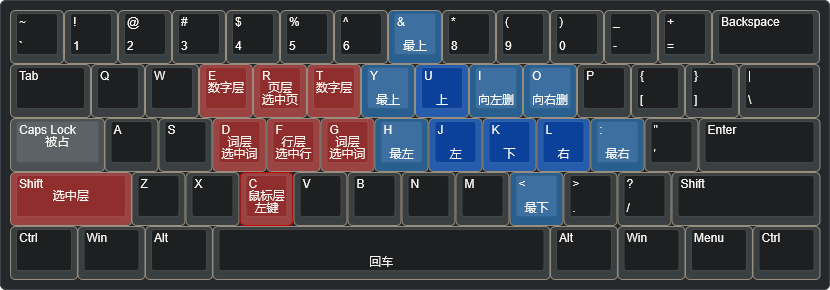

# AnyCaps

## AnyCaps 设计方案

感谢 https://keyboard-layout-editor.com/ 提供的键盘快捷键示意图生成方案

图片使用说明: 中间表示长按，下面表示短按

### 默认层

### 两个特殊层

这里还有两个特殊层 (Shift 和 Ctrl)，但内容过少我就不另外制图了

- Caps + 空格 = 回车
- Shift + 空格 = Shift + 回车
- Ctrl + 空格 = Ctrl + 回车

### Caps-光标层

Caps 与其子层与 Shift 按键完全兼容，**可以同时按住 Caps 和 Shift 进行选择**

### Caps-词层、选择层

先说词层

> 相当于按住Ctrl键的光标层，光标的左右移动会以单词为单位
> 
> 之所以这里使用另外的按键来代替Ctrl，是因为按住CapsLock的同时并不好再去按到Ctrl的位置，否则容易造成手位变形。当然，如果你喜欢你也可以去按Ctrl键

再说选择层

> 同上，可以与其他层相叠加

### Caps-行层

### Caps-页层

### Caps-鼠标层

### Caps-数字层

### 符号层

> [!warning]
> 对于 kanata 和 autohotkey 来说，当前的成对括号部分不是很好用，无法在保证快速的前提下识别是否有选中内容。AnyMenu 版本则无此问题

## vim默认层

`Caps+*` 对比传统的 vim 方案

vim方案其实并不适合直接用于 `Caps+*`，否则会存在一些缺点：

- 有些按键是很难在按住 `Caps` 的同时去按下的，特别是键盘左半区
- ESC按键过远，不适合频繁按
- 有些操作需要编辑器自身支持。而 `Caps+*` 应是先集成无需编辑器依赖的，再集成需要编辑器依赖的，保证泛用
- 需要返回命令模式再操作再回到插入模式的逻辑繁琐麻烦

(图片示意: 中间是长按或大写，下面是短按。蓝色是仅移动光标，红色是层，橙色是需要编辑器配合。可以辅助在线 vim 编辑来理解: https://rtool.cn/vim.html)

参考: https://www.runoob.com/w3cnote/all-vim-cheatsheat.html

## 比较

除了 AnyCaps 外，还存在着许多其他的 `Caps+` 或 类vim方案，如:

- 这里介绍的 AnyCaps
- 原版的 vim (局限于vim软件，或支持vim模式/插件的软件，如vscode、obsidian)
- CapsLock++
- CapsEZ
- ...

AnyCaps 的优点:

- 综合考虑: 易用度、对称性、记忆性、按键频率和手感、英文 (除非刚好能和前面的匹配上，作为一个顺带，否则不会使用按键英语作为决定按键位置的原因)
