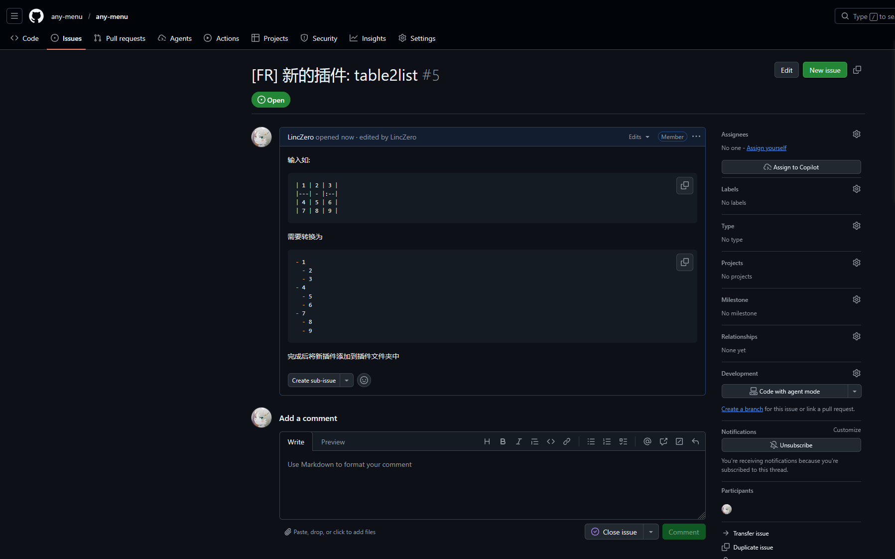
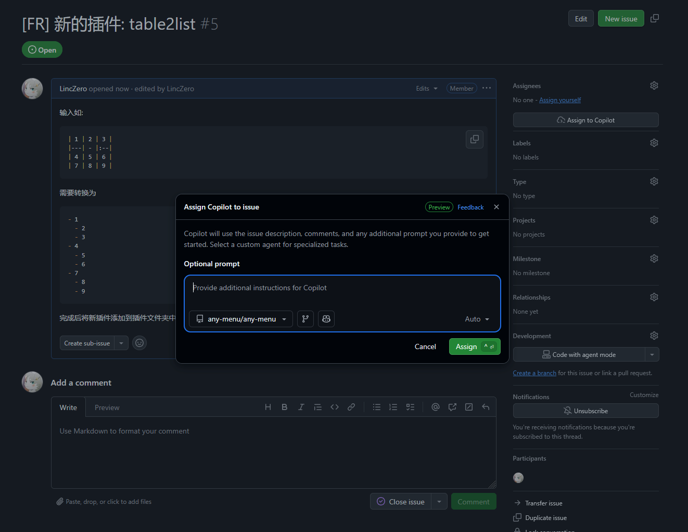
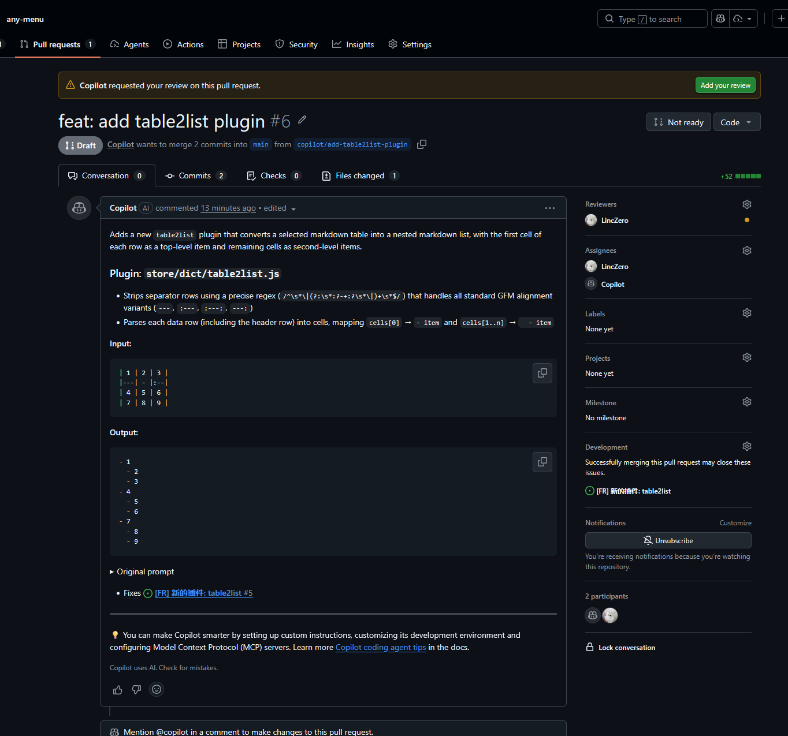
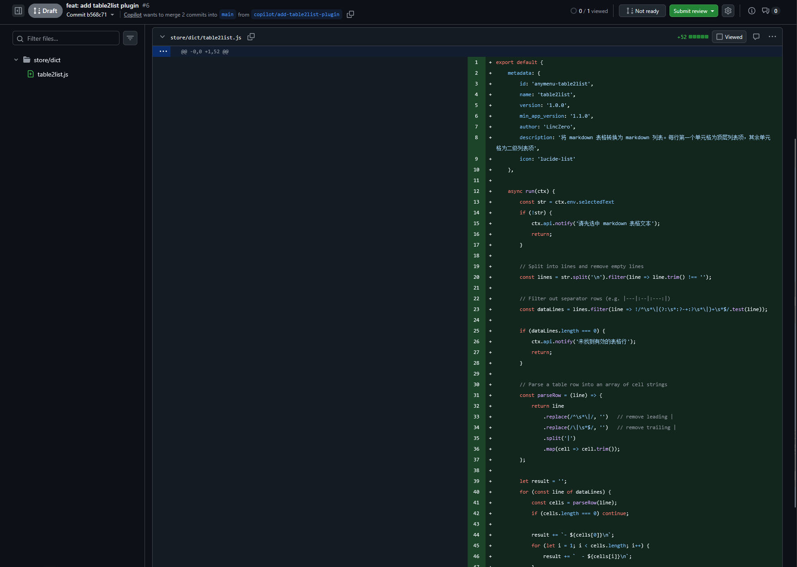
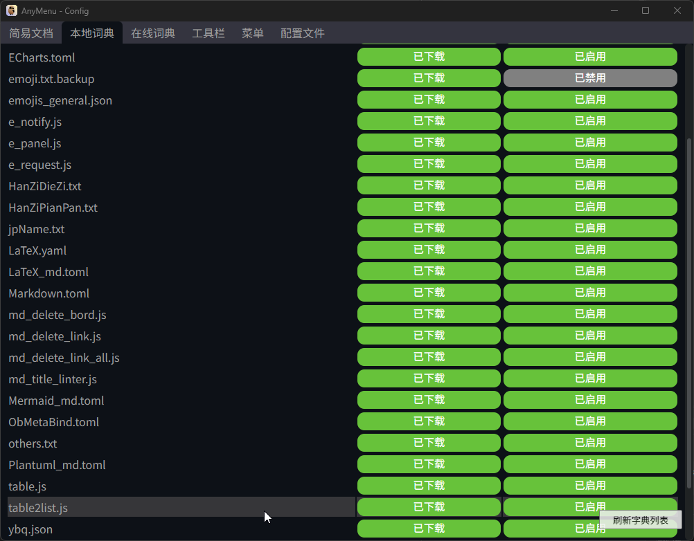
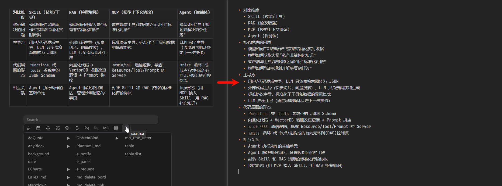

# 使用 AI 快捷添加 AnyMenu 脚本

(图文版)

这里以我自己添加官方插件为例，如果你只是自用的，流程会更加简单

(1) 提issue (或者该issue是用户提出的)

描述好需求，如果是用户提出的，开发者可以先补充完成



(2) 把任务交给 AI

点击右上角的 "Assign to Copilot"

在新的弹窗中

- 可选提示词。"Optional prompt" 窗口里提议填上提示词，例如:
  ```markdown
  尽量少修改，修成较少的代码diff。聚焦于此 issue，不要做无关的重构与优化
  ```
- 可切换模型。右下的 "Auto" 下拉框中可以换用别的 AI 模型，选择取决于此次任务的难度、时长、Token 预期。可选的模型有: (我这里是 copilot 付过费的，且为26年3月版本，你的不一定和这里一致)
  - Claude Opus 4.6、Claude Opus 4.5 (3倍，其余均1倍)
  - Claude Sonnet 4.6、Claude Sonnet 4.5
  - GPT-5.1-Codex-Max、GPT-5.2-Codex、GPT-5.3-Codex、GPT-5.4



(3) 等待AI完成

不用管他，等待一段时间后，AI 就完成工作啦 (时间与工作量及你选择的模型有关)。

完成后他会通知和请求你 review





(4) 检查并合并

接下来我们来验证一下 —— 运行得不错。然后自己 review 下代码，如果没有问题就可以合并此 PR 啦！




